# casas-en-disputa-materia-despliegue

Juego donde se aplican los conocimientos de la materia: Diseños y Arquitecturas de despliegues I

Profesor:Di Guardia Christian

Alumno: Magariños Chavez Gaston Nicolas

## Resumen de lo realizado

Para la entrega de la tarea se implementó una arquitectura modular, estos se encuentran dentro de la carpeta `src`.

La arquitectura modular se compone de un board.js(donde se encuentra la lógica del tablero),un generador.js(donde se encuentra la lógica de generación de las casas) y un referee.js(donde se encuentra la lógica de validación de los componentes del tablero).Todo esto es llamado por el archivo, app.js. para coordinar la ejecución del juego.

En el futuro se va a realizar el cambio de import/export pot la de module.export de commanJS

## Explicacion de como se llevo a cabo la tarea

La primer tarea era generar el tablero en su estado inicial,
para esto decidi crear una factory function con closure y objetos iterables, para poder iterar sobre el tablero y generar las casas en su estado inicial.

Esta factory function contiene unas variables constantes para la inicializacion del tablero, un bucccle for para crear un array de arrays, donde el primer for genera el subarreglo(fila) y el segundo for genera los elementos(columnas) de cada subarreglo, estos se ingresan en el array de arrays mediante el metodo push() y el valor que le asignamos es 0.
Y el return son los objetos iterables(metodos) con funciones para iterar sobre el tablero y obtener los valores de las casas.

- setCell: se utiliza para ingresar un valor en una celda especifica del tablero.
- getCell: se utiliza para obtener el valor de una celda especifica del tablero.
- viewBoard: se utiliza para obtener una representación visual del tablero.

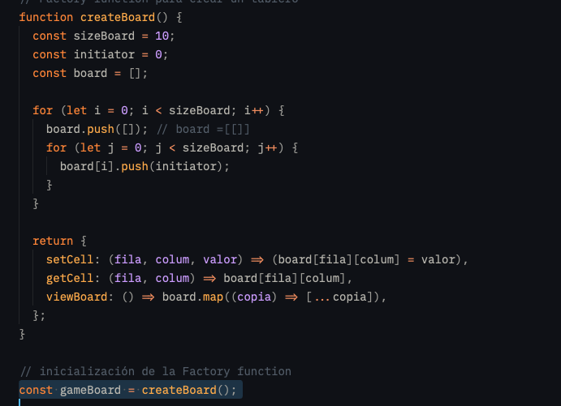

Este seria el tablero en su estado inicial:

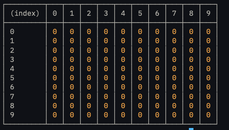

Para el generador, utilizamos un algoritmo de generador determinista llamado Mulberry32. este genera numeros pseudoaleatorios deterministicamente por semilla.

No tengo un conocimiento profundo de este algoritmo, pero lo utilice para generar los numeros aleatorios necesarios para colocar las casas en el tablero.

Se puede ver que es creado con una clase, tiene un constructor que recibe la semilla y un metodo next() que devuelve el siguiente numero aleatorio.
abajo se puede ver que se crea una instancia de la clase Mulberry32 y se utiliza para definir la semilla

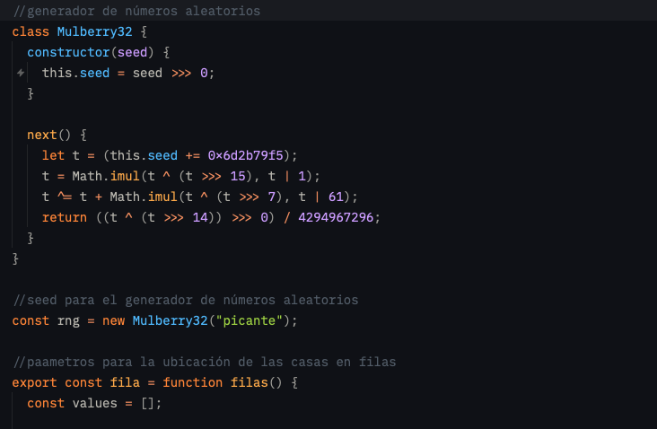

Luego armo la logica para la ubicacion de las casas en el tablero.
para esto decido crear dos funciones definidas con las variables fila y columna, estas funciones se encargan de calcular la ubicacion de las casas en el tablero devolviendo 2 arrays con 5 elementos.

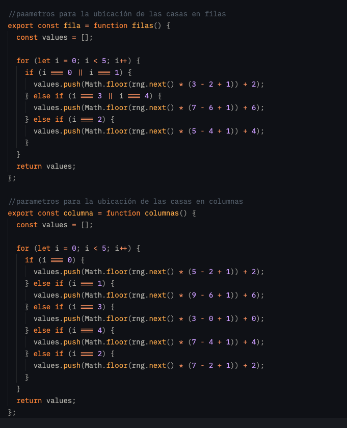

Su funcionamiento es el siguiente:

### Filas

Para las filas decido utilizar las posiciones del array para determinar la fila en la que se colocara cada casa y como limitacion le digo que no se creen numeros para las primeras filas 2 filas(0 y 1) y las 2 ultimas filas(8 y 9).

El codigo que genera los numeros esta compuesto de un .push() que agrega un numero aleatorio al array, un Math.floor() que redondea el numero aleatorio, la instancia de la clase Mulberry32 y una operacion que permite generar el numero en ciertos parametros ((max - min +1 )+ min)

- En la ubicacion 0(fila de la casa 1) y 1(fila de la casa 2) del array se va a almacenar un numero aleatorio entre 3 y 2.
- En la ubicacion 2(fila de la casa 3) del array se va a almacenar un numero entre el 5 y 4
- En la ubicacion 3(fila de la casa 4) y 4(fila de la casa 5)del array se va a almacenar un numero entre el 7 y 6

### Columnas

Para las columnas utilizamos la misma logica pero el orden es diferente.

- En la ubicacion 0(columna de la casa 1) del array se va a almacenar un numero aleatorio entre 5 y 2.
- En la ubicacion 1(columna de la casa 2) del array se va a almacenar un numero aleatorio entre 9 y 6.
- En la ubicacion 2(columna de la casa 3) del array se va a almacenar un numero entre el 7 y 2.
- En la ubicacion 3(columna de la casa 4) del array se va a almacenar un numero entre el 3 y 0.
- En la ubicacion 4(columna de la casa 5) del array se va a almacenar un numero entre el 7 y 4.

---

Grafico de las ubicaciones:
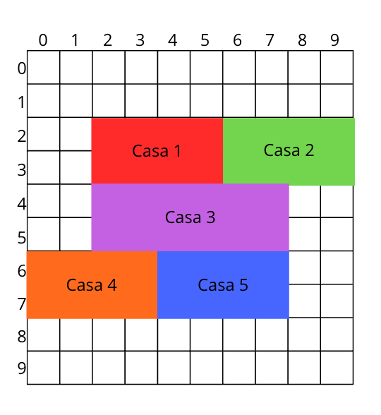

Para la comunicacion entre el tablero y el generador utilizamos import/export,
en el cual exportamos las funciones fila y columna y las importamos en el tablero.
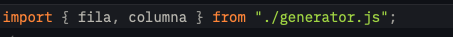
y para colocarlos en el tablero utilizamos la siguiente logica:
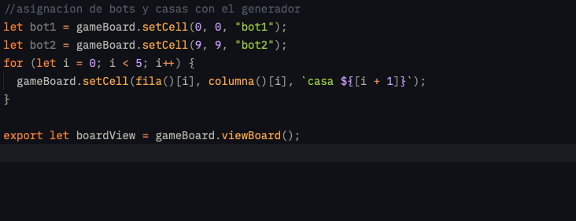
y nos quedaria asi en la terminal
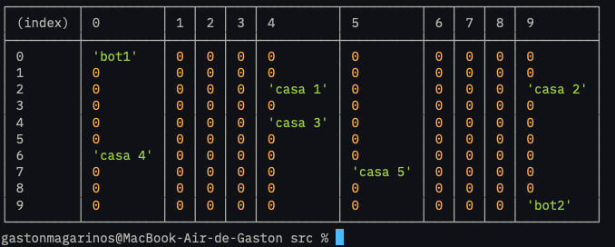

---

Y para las verificaciones, decidi crear un validador para verificar si en el tablero se encuentran los elementos y otro para verificar los movimientos de los bots.

#### Verificador de los elementos

importamos la vista del tablero
creamos un array values con los valores que se esperan encontrar en el tablero
decalaramos una variable flatBoard que aplana con el metodo flat() el tablero en un array unidimensional y luego comparamos si los valores del array values se encuentran en el array flatBoard mediante los metodos includes() y every()
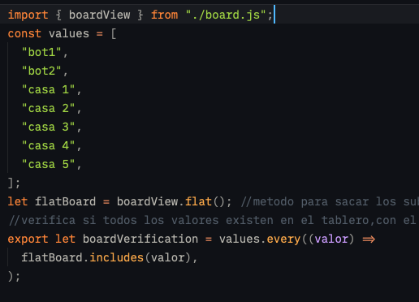

#### Verificador de los movimientos

Para los movimientos se crearon tres funciones: movimientoBot, checkBoard y comparacion

La primera funcion se encarga de detectar a donde se tendria que mover el bot en base a 2 parametros, movimiento que es el parametro que el bot tendria que pasarle como argumento a la funcion para que sepa a donde se movio y el parametro dado, que seria el valor del dado que el bot obtuvo al lanzarlo.
la operacion que se utiliza en la logica es una que se usa en el snake cuando este decide por ej: subir y reaparecer abajo de la pantalla que es la para este caso del bot movimiento arriba (fila - dado+10) % 10: esta operacion permite que cuando llegue al borde superior, el bot se mueva hacia abajo en lugar de salir del tablero el mod es lo que mantiene esto.

---

La segunda funcion se encarga de encontrar la posicion del bot en el tablero.
este tiene un parametro turno para saber que bot tiene el turno actual y mediante un bucle for para recorrer las filas y un condicional if para buscar el indice en los subarrays de las filas(columnas) y este retorna la posicion del bot en el tablero con un array.
en esta funcion tuve un problema con el if porque resulta que el if cuando te devuelve un 0 te devuelve un falsy por eso encontre que si le ponia !== -1 si me devuelve el 0 si la ubicacion se encuentra en el indice 0

---

La tercera funcion se encarga de comparar los return de los arrays que devuelven las funciones movimientoBot y checkBoard y devuelve el resultado de la comparacion.
utilizamos toString porque me resulto mas facil la comparacion en string que hacerlo mediante los arrays.la comparacion devuelve un true si coinciden y un false si no coinciden.
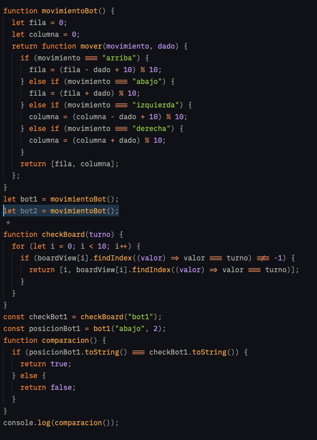

### La union de todo se encuentra en el archivo app.js

Aca por el momento importe la verificacion del tablero y la vista del tablero

y cree una funcion llamada funcionamiento Juego que tiene un condicional que si la verificacion del tablero es true entonces se muestra el tablero y si es false imprime la leyenda que el tablero no esta en regla.
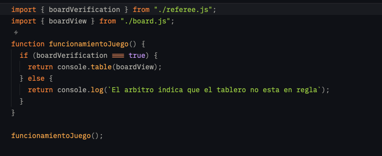
